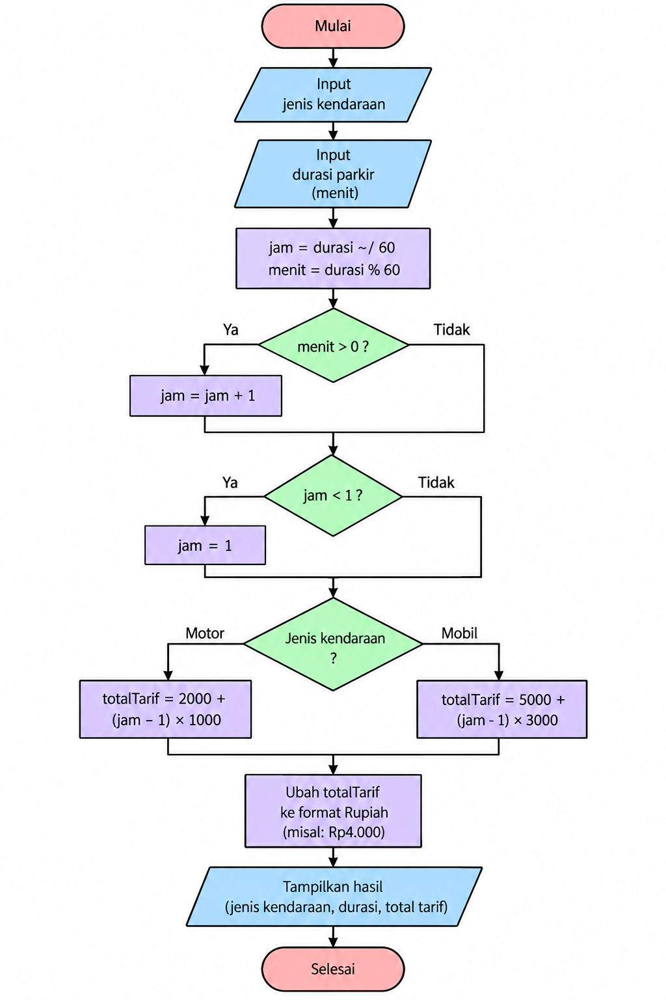

# Latihan 2 — Tarif Parkir

## Kelompok

- **Daffa Dermawan** (1124160177)
- **M. Raffi Ar-Rosyid** (1124160189)

---

## A. Dokumen Analisis

### 1. Problem Statement

Pada latihan ini kami membuat program sederhana untuk menghitung tarif parkir.

Program menerima dua data, yaitu jenis kendaraan dan lama parkir. Lama parkir dimasukkan dalam satuan menit. Setelah itu durasi diubah menjadi jam. Jika masih ada sisa menit, maka waktunya dibulatkan ke atas.

Tarif parkir dibedakan menjadi dua jenis kendaraan, yaitu motor dan mobil.

---

### 2. Actor

Actor yang menggunakan sistem adalah **petugas parkir atau pengguna kendaraan**.

Data yang diberikan:

* Jenis kendaraan
* Durasi parkir dalam menit

Setelah data diproses, program menampilkan total tarif parkir.

---

### 3. Input & Output

#### Input

| Data            | Tipe             | Contoh  |
| --------------- | ---------------- | ------- |
| Jenis kendaraan | `jeniskendaraan` | `motor` |
| Durasi parkir   | `int`            | `150`   |

Durasi menggunakan satuan menit.

#### Output

Program menampilkan:

* Jenis kendaraan
* Durasi parkir
* Total tarif

Contoh:

```text
Jenis Kendaraan: motor | Durasi: 150 menit | Total: Rp4.000
```

---

### 4. Functional Requirement

Program memiliki beberapa fungsi utama:

1. Menerima jenis kendaraan.
2. Menerima durasi parkir dalam menit.
3. Mengubah durasi menit menjadi jam.
4. Membulatkan durasi ke atas jika terdapat sisa menit.
5. Menghitung tarif motor.
6. Menghitung tarif mobil.
7. Menampilkan hasil perhitungan.

---

### 5. Business Rules

| Kode  | Business Rule                                                                                     |
| ----- | ------------------------------------------------------------------------------------------------- |
| BR-01 | Durasi parkir dihitung per jam. Jika terdapat sisa menit, maka dibulatkan ke atas. Minimal 1 jam. |
| BR-02 | Motor dikenakan Rp2.000 untuk jam pertama dan Rp1.000 untuk setiap jam berikutnya.                |
| BR-03 | Mobil dikenakan Rp5.000 untuk jam pertama dan Rp3.000 untuk setiap jam berikutnya.                |

---

### 6. Decomposition

Atau proses membagi masalah menjadi beberapa bagian supaya lebih mudah dikerjakan.

```text
Tarif Parkir
│
├── Menentukan kendaraan
│   ├── Motor
│   └── Mobil
│
├── Menghitung durasi
│   ├── Hitung jam
│   ├── Hitung sisa menit
│   └── Pembulatan
│
├── Menghitung tarif
│   ├── Tarif motor
│   └── Tarif mobil
│
└── Menampilkan hasil
```

Jadi disini kita tidak langsung membuat semua kode sekaligus. melainkan pecah dulu menjadi beberapa bagian kecil.

---

### 7. Pattern Recognition

Setelah melihat aturan tarif, terdapat pola yang sama antara motor dan mobil.

Tarif terdiri dari tarif jam pertama ditambah tarif untuk jam berikutnya.

Rumusnya:

```text
Tarif = tarif jam pertama + (jam - 1) × tarif jam berikutnya
```

Untuk motor:

```text
2000 + (jam - 1) × 1000
```

Untuk mobil:

```text
5000 + (jam - 1) × 3000
```

Untuk durasi juga ada pola yang bisa digunakan.

```text
jam = durasi ~/ 60
sisa menit = durasi % 60
```

Kalau masih ada sisa menit, jumlah jam ditambah satu.

Contohnya:

```text
150 menit

150 ~/ 60 = 2 jam
150 % 60 = 30 menit

Karena masih ada 30 menit:
2 + 1 = 3 jam
```

---

### 8. Abstraction

Untuk membatasi jenis kendaraan, kita perlu menggunakan `enum`.

```dart
enum jeniskendaraan {
  motor,
  mobil,
}
```

Dengan begitu jenis kendaraan yang digunakan dalam program hanya berasal dari dua pilihan tersebut.

Data yang digunakan oleh fungsi utama adalah:

```dart
jeniskendaraan kendaraan
int durasi
```

Kemudian proses perhitungan dibuat dalam function:

```dart
String tarifParkir(
  jeniskendaraan kendaraan,
  int durasi,
)
```

Function tersebut menerima kendaraan dan durasi, kemudian mengembalikan hasil perhitungan dalam bentuk `String`.

---

### 10. Flowchart



---

### 11. Pseudocode

```text
START

INPUT kendaraan
INPUT durasi

jam ← durasi DIV 60
menit ← durasi MOD 60

IF menit > 0 THEN
    jam ← jam + 1
END IF

IF jam < 1 THEN
    jam ← 1
END IF

SWITCH kendaraan

    CASE motor:
        totalTarif ← 2000 + (jam - 1) × 1000

    CASE mobil:
        totalTarif ← 5000 + (jam - 1) × 3000

END SWITCH

Tampilkan kendaraan
Tampilkan durasi
Tampilkan totalTarif

END
```

---

# B. Implementasi Dart

```dart
void main() {
  print(tarifParkir(jeniskendaraan.motor, 30));
  print(tarifParkir(jeniskendaraan.motor, 150));
  print(tarifParkir(jeniskendaraan.mobil, 60));
  print(tarifParkir(jeniskendaraan.mobil, 181));
}

enum jeniskendaraan {
  motor,
  mobil,
}

String tarifParkir(jeniskendaraan kendaraan, int durasi) {
  int jam = durasi ~/ 60;
  int menit = durasi % 60;

  if (menit > 0) {
    jam = jam + 1;
  }

  if (jam < 1) {
    jam = 1;
  }

  int totalTarif = switch (kendaraan) {
    jeniskendaraan.motor => 2000 + (jam - 1) * 1000,
    jeniskendaraan.mobil => 5000 + (jam - 1) * 3000,
  };

  String strTarif = totalTarif.toString();

  String bagianDepan = strTarif.substring(0,strTarif.length - 3);

  String bagianBelakang = strTarif.substring(strTarif.length - 3);

  String nominal = 'Rp$bagianDepan.$bagianBelakang';

  return 'Jenis Kendaraan: ${kendaraan.name} | Durasi: $durasi menit | Total: $nominal';
}
```

---

# C. Skenario Pengujian

| Skenario | Kendaraan |    Durasi | Expected | Hasil    |
| -------- | --------- | --------: | -------: | -------- |
| 1        | Motor     |  30 menit |  Rp2.000 | Rp2.000  |
| 2        | Motor     | 150 menit |  Rp4.000 | Rp4.000  |
| 3        | Mobil     |  60 menit |  Rp5.000 | Rp5.000  |
| 4        | Mobil     | 181 menit | Rp14.000 | Rp14.000 |

Semua hasil sesuai dengan business rule yang diberikan.

---

# D. Traceability

| Business Rule | Bagian Program              | Skenario   |
| ------------- | --------------------------- | ---------- |
| BR-01         | `~/`, `%`, pembulatan menit | 1, 2, 3, 4 |
| BR-02         | `jeniskendaraan.motor`      | 1, 2       |
| BR-03         | `jeniskendaraan.mobil`      | 3, 4       |

Contoh hubungan BR-03 dengan kode:

```dart
jeniskendaraan.mobil =>
    5000 + (jam - 1) * 3000
```

Artinya:

```text
Jam pertama       = Rp5.000
Jam berikutnya    = Rp3.000
```

---

# E. Contoh Trace Skenario 4

Input:

```text
Kendaraan = Mobil
Durasi = 181 menit
```

Pertama menghitung jam:

```text
181 ~/ 60 = 3
```

Kemudian mencari sisa:

```text
181 % 60 = 1
```

Karena masih ada sisa 1 menit, maka:

```text
3 + 1 = 4 jam
```

Kemudian tarif mobil dihitung:

```text
Rp5.000 + (4 - 1) × Rp3.000

= Rp5.000 + Rp9.000

= Rp14.000
```

Hasil akhirnya:

```text
Jenis Kendaraan: mobil | Durasi: 181 menit | Total: Rp14.000
```
